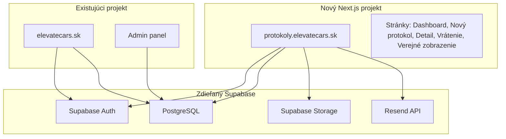
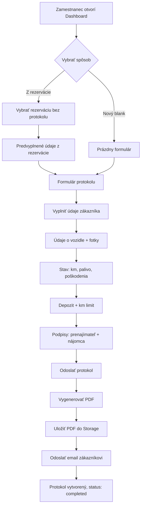
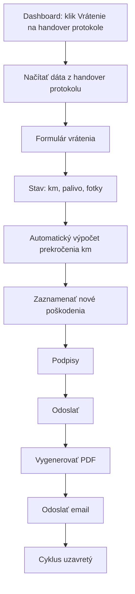
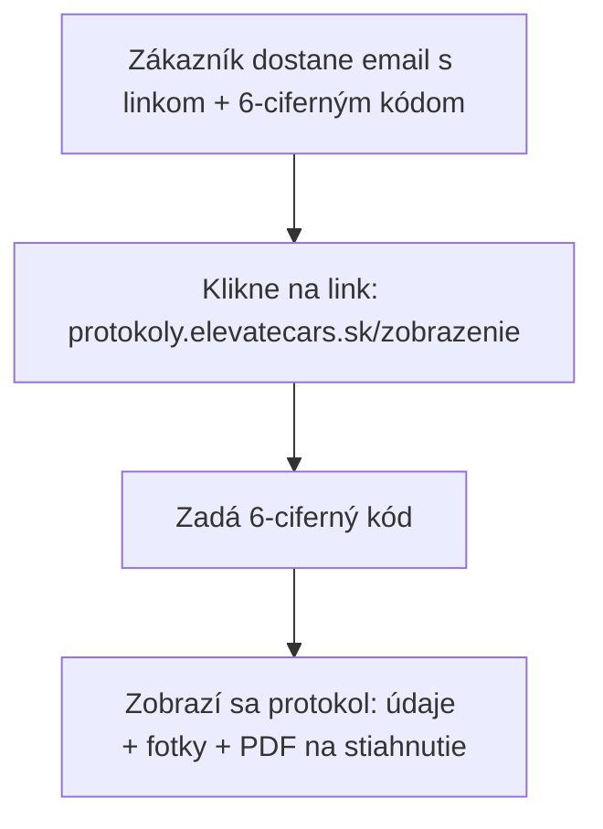

# PRD: Protokoly ElevateCars

## 1. Prehľad projektu

**Názov:** Protokoly ElevateCars
**Doména:** `protokoly.elevatecars.sk`
**Typ:** Interná mobile-first webová aplikácia
**Účel:** Digitálne odovzdávacie a preberacie protokoly pre autopožičovňu
**Jazyk UI:** Slovenčina (single-locale)
**Používatelia:** ~5 zamestnancov/adminov

---

## 2. Architektúra



**Kľúčové rozhodnutia:**
- Samostatný Next.js projekt (nie monorepo)
- Rovnaká Supabase inštancia (DEV: `vvmqdolrhesuxkcwunka`)
- Nový Storage bucket `protocol-documents` pre PDF
- Fotky protokolov do bucketu `protocol-photos`
- Hosting na Vercel
- Žiadny checklist vybavenia (v1)
- Fotky poškodení + textový popis (bez interaktívnej schémy auta)

---

## 3. Tech Stack

| Technológia | Verzia | Účel |
|---|---|---|
| Next.js | 16 | Framework (App Router) |
| React | 19 | UI |
| TypeScript | 5+ | Typovanie |
| Tailwind CSS | 4 | Styling |
| Supabase (SSR) | @supabase/ssr ^0.8 | Auth + DB + Storage |
| @react-pdf/renderer | latest | PDF generovanie |
| Resend | latest | Email odosielanie |
| sonner | latest | Toast notifikácie |
| react-signature-canvas | latest | Podpis na canvase |
| Lucide React | latest | Ikony |
| Radix UI | latest | Headless UI primitívy |

---

## 4. Environment premenné

```env
# Supabase (rovnaké ako hlavný projekt)
NEXT_PUBLIC_SUPABASE_URL=https://vvmqdolrhesuxkcwunka.supabase.co
NEXT_PUBLIC_SUPABASE_PUBLISHABLE_OR_ANON_KEY=<anon key z existujúceho projektu>
SUPABASE_SERVICE_ROLE_KEY=<service role key z existujúceho projektu>

# Email
RESEND_API_KEY=<rovnaký ako hlavný projekt>

# App
NEXT_PUBLIC_APP_URL=https://protokoly.elevatecars.sk
NEXT_PUBLIC_MAIN_SITE_URL=https://elevatecars.sk
```

**Poznámka:** Všetky Supabase kľúče sú rovnaké ako v existujúcom projekte. Resend API key tiež.

---

## 5. Databázová schéma

### 5.1 Nová tabuľka: `handover_protocols`

```sql
CREATE TABLE public.handover_protocols (
  id UUID PRIMARY KEY DEFAULT gen_random_uuid(),
  
  -- Väzby
  reservation_id UUID REFERENCES public.reservations(id) ON DELETE SET NULL,
  car_id UUID REFERENCES public.cars(id) ON DELETE SET NULL,
  
  -- Typ protokolu
  type TEXT NOT NULL CHECK (type IN ('handover', 'return')),
  -- Pre return protokol — odkaz na pôvodný handover
  handover_protocol_id UUID REFERENCES public.handover_protocols(id) ON DELETE SET NULL,
  
  -- Zákazník
  customer_first_name TEXT NOT NULL,
  customer_last_name TEXT NOT NULL,
  customer_email TEXT NOT NULL,
  customer_phone TEXT,
  customer_id_card_front_url TEXT,
  customer_id_card_back_url TEXT,
  customer_driver_license_url TEXT,
  
  -- Vozidlo
  car_name TEXT NOT NULL,
  car_license_plate TEXT NOT NULL,
  reservation_number TEXT,
  
  -- Dátumy
  protocol_datetime TIMESTAMPTZ NOT NULL DEFAULT now(),
  expected_return_datetime TIMESTAMPTZ,
  
  -- Lokácia
  location TEXT,
  
  -- Stav vozidla
  mileage_km INTEGER NOT NULL,
  mileage_photo_url TEXT,
  fuel_level TEXT NOT NULL CHECK (fuel_level IN ('1/4', '2/4', '3/4', '4/4')),
  fuel_photo_url TEXT,
  
  -- Km limit (len pre handover)
  allowed_km INTEGER,
  
  -- Km prekročenie (len pre return, vypočítané)
  km_exceeded INTEGER,
  km_exceeded_price NUMERIC(10,2),
  extra_km_rate NUMERIC(10,2),
  
  -- Financie
  deposit_amount NUMERIC(10,2),
  deposit_method TEXT CHECK (deposit_method IN ('cash', 'bank_transfer', 'card_hold')),
  
  -- Fotky auta (array URL-iek)
  car_photos TEXT[] DEFAULT '{}',
  
  -- Poškodenia
  damages JSONB DEFAULT '[]',
  -- Formát: [{"description": "Škrabanec na ľavých dverách", "photo_urls": ["url1", "url2"]}]
  
  -- Podpisy (URL obrázkov v Storage)
  signature_landlord_url TEXT,
  signature_tenant_url TEXT,
  
  -- Interné poznámky
  internal_notes TEXT,
  
  -- PDF
  pdf_url TEXT,
  
  -- Verejný prístup
  access_code TEXT NOT NULL DEFAULT lpad(floor(random() * 1000000)::text, 6, '0'),
  
  -- Metadata
  created_by UUID REFERENCES auth.users(id),
  created_at TIMESTAMPTZ DEFAULT now(),
  updated_at TIMESTAMPTZ DEFAULT now(),
  
  -- Stav
  status TEXT NOT NULL DEFAULT 'draft' CHECK (status IN ('draft', 'completed'))
);

-- Indexy
CREATE INDEX idx_handover_protocols_reservation ON public.handover_protocols(reservation_id);
CREATE INDEX idx_handover_protocols_car ON public.handover_protocols(car_id);
CREATE INDEX idx_handover_protocols_type ON public.handover_protocols(type);
CREATE INDEX idx_handover_protocols_status ON public.handover_protocols(status);
CREATE INDEX idx_handover_protocols_access_code ON public.handover_protocols(access_code);

-- RLS
ALTER TABLE public.handover_protocols ENABLE ROW LEVEL SECURITY;

-- Len admini majú prístup
CREATE POLICY "Admins can do everything on protocols"
  ON public.handover_protocols FOR ALL
  USING (
    EXISTS (SELECT 1 FROM public.profiles WHERE id = auth.uid() AND is_admin = true)
  );

-- Verejné čítanie cez access_code (pre zákazníkov)
CREATE POLICY "Public can view protocol with access code"
  ON public.handover_protocols FOR SELECT
  USING (true);
  -- Aplikácia filtruje podľa access_code v API route
```

### 5.2 Supabase Storage buckety

```sql
-- Bucket pre PDF protokoly
INSERT INTO storage.buckets (id, name, public, file_size_limit)
VALUES ('protocol-documents', 'protocol-documents', false, 10485760);

-- Bucket pre fotky protokolov
INSERT INTO storage.buckets (id, name, public, file_size_limit)
VALUES ('protocol-photos', 'protocol-photos', false, 10485760);
```

---

## 6. Stránky a Routing

```
/ ............................ Dashboard (zoznam protokolov)
/novy ........................ Nový odovzdávací protokol
/novy?reservation=<id> ....... Nový protokol z rezervácie (predvyplnený)
/protokol/[id] ............... Detail protokolu
/protokol/[id]/vratenie ...... Preberací protokol (return)
/zobrazenie .................. Verejné zobrazenie (zadanie kódu)
/zobrazenie/[id] ............. Verejný detail protokolu
/auth/login .................. Prihlásenie
```

---

## 7. User Flow

### 7.1 Odovzdávací protokol (Handover)



### 7.2 Preberací protokol (Return)



### 7.3 Zákazník — zobrazenie protokolu



---

## 8. Detailný popis obrazoviek

### 8.1 Dashboard (`/`)
- **Chránená stránka** — len admini (inak redirect na elevatecars.sk)
- **Horná lišta:** Logo, meno prihláseného, logout
- **Akcie:** Tlačidlo "Nový protokol"
- **Tabs:** "Aktívne" (handover bez return) | "Dokončené" (s return) | "Všetky"
- **Zoznam kariet:** Každá karta zobrazuje:
  - Meno zákazníka
  - Auto (názov + ŠPZ)
  - Dátum odovzdania
  - Status (odovzdané / vrátené)
  - Tlačidlo "Vrátenie" (ak ešte nemá return protokol)
  - Tlačidlo "Detail"
- **Vyhľadávanie:** Podľa mena, ŠPZ, čísla rezervácie
- **Poradie:** Najnovšie prvé

### 8.2 Nový protokol (`/novy`)
- **Krok 1: Výber zdroja**
  - Dropdown/search: Vybrať z existujúcich rezervácií (len tie bez protokolu)
  - Alebo: "Vytvoriť bez rezervácie"
  - Pri výbere rezervácie sa predvyplnia: meno, email, telefón, auto, ŠPZ, číslo rez., km limit, odhadovaný návrat

- **Krok 2: Formulár** (jeden dlhý scrollovateľný formulár, mobile-first)

  **Sekcia: Zákazník**
  - Meno (text input)
  - Priezvisko (text input)
  - Email (email input)
  - Telefón (phone input)
  - OP predná strana (fotka — camera/upload)
  - OP zadná strana (fotka — camera/upload)
  - Vodičský preukaz (fotka — camera/upload)

  **Sekcia: Vozidlo a prenájom**
  - Názov auta (text / autocomplete z DB)
  - ŠPZ (text input)
  - Číslo rezervácie (text, readonly ak z rezervácie)
  - Dátum a čas odovzdania (datetime picker)
  - Miesto odovzdania (text input)
  - Odhadovaný dátum vrátenia (datetime picker)
  - Povolený nájazd km (number)

  **Sekcia: Stav vozidla**
  - Stav tachometra — fotka (camera/upload)
  - Stav tachometra — počet km (number input)
  - Stav paliva — fotka (camera/upload)
  - Stav paliva — výber (1/4, 2/4, 3/4, 4/4) — vizuálne tlačidlá
  - Fotky auta — multi-upload (min 4 strany auta)
  - Poškodenia — opakovateľná sekcia:
    - Popis poškodenia (text)
    - Fotky poškodenia (multi-upload)
    - Tlačidlo "Pridať poškodenie"

  **Sekcia: Financie**
  - Depozit v EUR (number)
  - Spôsob depozitu (dropdown: Hotovosť / Bankový prevod / Zadržané na karte)

  **Sekcia: Poznámky**
  - Interné poznámky (textarea, neviditeľné pre zákazníka)

  **Sekcia: Podpisy**
  - Podpis prenajímateľa (signature canvas)
  - Podpis nájomcu (signature canvas)
  - Pod každým: tlačidlo "Vymazať" na nový pokus

  **Odoslanie:**
  - Tlačidlo "Vytvoriť protokol"
  - Validácia povinných polí
  - Loading stav počas generovania PDF + odosielania emailu
  - Po úspechu: redirect na detail protokolu

### 8.3 Detail protokolu (`/protokol/[id]`)
- Zobrazenie všetkých údajov z protokolu (read-only)
- Galéria fotiek (auto, poškodenia, dokumenty, tachometer, palivo)
- Podpisy
- Tlačidlo "Stiahnuť PDF"
- Ak typ = handover a ešte nemá return: tlačidlo "Vytvoriť preberací protokol"
- Ak má return: link na return protokol

### 8.4 Preberací protokol (`/protokol/[id]/vratenie`)
- Predvyplnené z handover protokolu: zákazník, auto, ŠPZ
- Nové polia:
  - Dátum a čas vrátenia
  - Miesto vrátenia
  - Stav tachometra (fotka + km)
  - Stav paliva (fotka + výber)
  - Fotky auta pri vrátení
  - Nové poškodenia
  - **Automatický výpočet prekročenia km:**
    - `km_exceeded = return_mileage - handover_mileage - allowed_km`
    - `km_exceeded_price = km_exceeded * car.extra_km_price`
    - Zobrazenie: "Prekročenie: 150 km x 0.30 EUR = 45.00 EUR"
  - Podpisy
  - Poznámky
- Generovanie PDF + email rovnako ako pri handoveri

### 8.5 Verejné zobrazenie (`/zobrazenie`)
- **Nechránená stránka** (bez loginu)
- Input: 6-ciferný kód
- Po zadaní: zobrazenie protokolu (údaje + fotky + PDF na stiahnutie)
- Nezobrazovať: interné poznámky, podpis prenajímateľa

### 8.6 Login (`/auth/login`)
- Supabase Auth: email + heslo
- Google OAuth (rovnaké ako hlavný projekt)
- Po prihlásení: ak `is_admin = false` → redirect na `elevatecars.sk`
- Ak `is_admin = true` → redirect na Dashboard

---

## 9. PDF Protokol

**Obsah PDF (odovzdávací):**
- Hlavička: Logo ElevateCars, "Odovzdávací protokol"
- Číslo protokolu, dátum
- Údaje zákazníka (meno, adresa, email, telefón)
- Údaje vozidla (názov, ŠPZ, číslo rezervácie)
- Stav pri odovzdaní (km, palivo, povolený nájazd)
- Depozit + spôsob
- Zoznam poškodení (text)
- Odhadovaný dátum vrátenia
- Podpisy (obrázky)
- Poznámka: "Pre zobrazenie fotodokumentácie navštívte protokoly.elevatecars.sk/zobrazenie a zadajte kód: XXXXXX"

**Obsah PDF (preberací):**
- Rovnaké ako handover +
- Stav pri vrátení (km, palivo)
- Výpočet prekročenia km
- Nové poškodenia

---

## 10. Email šablóna

**Predmet:** "Protokol o odovzdaní vozidla | ElevateCars"

**Obsah:**
- Pozdrav s menom zákazníka
- Informácia o vozidle (názov, ŠPZ)
- Dátum odovzdania/vrátenia
- **Príloha: PDF protokol**
- "Pre zobrazenie kompletného protokolu s fotodokumentáciou:"
- Link: `protokoly.elevatecars.sk/zobrazenie`
- Kód: `XXXXXX`
- Kontaktné údaje ElevateCars

---

## 11. Projektová štruktúra

```
protokoly-elevatecars/
  app/
    layout.tsx              -- Root layout, Toaster, fonty
    (auth)/
      login/page.tsx        -- Prihlásenie
    (protected)/
      layout.tsx            -- Admin guard + shell (header, nav)
      page.tsx              -- Dashboard
      novy/page.tsx         -- Nový protokol
      protokol/
        [id]/
          page.tsx          -- Detail protokolu
          vratenie/page.tsx -- Preberací protokol
    zobrazenie/
      page.tsx              -- Zadanie kódu
      [id]/page.tsx         -- Verejný detail
    api/
      protocols/
        route.ts            -- CRUD protokolov
        [id]/route.ts       -- Detail/update
        [id]/pdf/route.ts   -- Generovanie PDF
      upload/
        route.ts            -- Upload fotiek
      email/
        route.ts            -- Odoslanie emailu
      public/
        verify/route.ts     -- Overenie access kódu
  components/
    ui/                     -- Základné UI komponenty (button, input, select...)
    protocol-form/          -- Formulár protokolu
    signature-pad/          -- Podpis canvas
    photo-upload/           -- Fotka upload (camera + galéria)
    fuel-level-picker/      -- Vizuálny výber paliva
    protocol-card/          -- Karta v dashboarde
    protocol-detail/        -- Zobrazenie detailu
    pdf/                    -- PDF šablóny
    email/                  -- Email šablóny
  lib/
    supabase/
      client.ts             -- Browser client
      server.ts             -- Server client
      admin.ts              -- Service role client
    auth.ts                 -- requireAdmin helper
    database.types.ts       -- Generované typy (z rovnakej DB)
    utils.ts                -- Pomocné funkcie
  public/
    logo.svg
```

---

## 12. Implementačný plán (poradie)

### Fáza 1: Základ (projekt + auth + DB) ✅ COMPLETED
1. ✅ Vytvoriť Next.js 16 projekt s Tailwind 4
2. ✅ Nastaviť Supabase klienty (client, server, admin)
3. ✅ Vytvoriť databázovú migráciu (`handover_protocols` + storage buckety)
4. ✅ Pushnúť migráciu na DEV Supabase
5. ✅ Vygenerovať `database.types.ts`
6. ✅ Implementovať auth (login stránka + admin guard + proxy)

### Fáza 2: Dashboard ✅ COMPLETED
7. ✅ Layout (header, navigácia, mobile-friendly shell)
8. ✅ Dashboard stránka — zoznam protokolov s tabmi a vyhľadávaním
9. ✅ Protocol card komponent (s thumbnail z `car_photos[0]` cez signed URL)

### Fáza 3: Odovzdávací protokol ✅ COMPLETED
10. ✅ Formulár — sekcia zákazník (vrátane povinných fotiek OP front/back, vodičák)
11. ✅ Formulár — sekcia vozidlo + prenájom (vrátane výberu z rezervácií, fix timezone bugu)
12. ✅ Formulár — sekcia stav vozidla (fotky, km, palivo)
13. ✅ Formulár — sekcia poškodenia (opakovateľné, multi-foto upload)
14. ✅ Formulár — sekcia financie
15. ✅ Formulár — podpisový canvas (modal s "Podpísať" buttonom + full-screen pad)
16. ✅ Upload fotiek (camera support na mobile, lightbox s navigáciou)
17. ✅ API route pre uloženie protokolu (POST + PATCH pre drafty)
18. ✅ "Predpripravené" workflow — secondary button "Uložiť ako predpripravené" + nová kategória na `/novy`
19. ✅ Cross-environment UUID helper (`lib/uuid.ts`) — fallback pre HTTP/iOS bez secure context

### Fáza 4: PDF + Email ✅ COMPLETED
18. ✅ PDF šablóna (`components/pdf/protocol-pdf.tsx` — @react-pdf/renderer)
    - Roboto font (Regular/Medium/Bold/Italic) pre plnú podporu slovenských diakritík
    - Hardcoded "Elevate Cars" branding (`email`/`phone` z `public.settings`)
    - Sekcie: zákazník, vozidlo, stav, financie, poškodenia, podpisy, access kód
    - Pre return protokoly: km prekročenie + porovnanie s handover stavom
19. ✅ API route `POST /api/protocols/[id]/pdf` — vygeneruje, uloží do `protocol-documents` bucketu, vráti signed URL, uloží `pdf_url` do DB
20. ✅ Email šablóna (`lib/email-templates.ts`) — HTML + plain text, "Tím Elevate Cars" signature
21. ✅ Odoslanie emailu s PDF prílohou cez Resend (`POST /api/protocols/[id]/email`)
    - From: `Elevate Cars <protokoly@elevatecars.sk>` (override cez `RESEND_FROM_EMAIL`)
    - Reply-To: kontaktný email firmy z `public.settings`
    - Filename prílohy: `odovzdavaci-protokol-{ACCESS_CODE}.pdf` (alebo `preberaci-`)
22. ✅ Klientský flow vo `protocol-form.tsx`: po `POST /api/protocols` sa awaitujú PDF + email volania pred redirectom (toast progres "Generujem PDF a posielam email...")
23. ✅ Lokálny preview script `scripts/preview-protocol.tsx` (handover + return PDF + HTML email)

### Fáza 5: Detail + Verejné zobrazenie ✅ COMPLETED
24. ✅ Detail protokolu stránka `/protokol/[id]` — všetky sekcie + galéria fotiek + lightbox
25. ✅ Akcie na detaile: Stiahnuť PDF / Regenerovať PDF / Poslať email znova / Vytvoriť preberací protokol
26. ✅ Server-side helper `lib/queries/protocol-detail.ts` — generuje signed URLs pre všetky fotky v jednom batchi (1h expirácia) + signed URL pre PDF
27. ✅ Reusable komponent `ProtocolDetailView` (s `isPublic` prop) — zdieľaný medzi admin a verejným zobrazením
28. ✅ Verejná stránka `/zobrazenie` — 6-cifrový kód input (auto-focus medzi políčkami, paste support, OTP autocomplete)
29. ✅ API route `POST /api/public/verify` — overí kód (admin client, neexponuje protokol ID kým kód nie je správny)
30. ✅ Verejný detail `/zobrazenie/[id]` — skryté: depozit, interné poznámky, podpis prenajímateľa, doklady zákazníka, prístupový kód
31. ✅ Email šablóna obsahuje **one-click link** s predvyplneným kódom (`?kod=XXXXXX`) + manuálny fallback
32. ✅ Po vytvorení protokolu → redirect na `/protokol/[id]` (nie na 404)

### Fáza 6: Preberací protokol ✅ COMPLETED
33. ✅ Stránka `/protokol/[id]/vratenie` — predvyplnenie z handoveru (zákazník, auto, ŠPZ readonly)
34. ✅ Reusable `ProtocolForm` rozšírený o `mode: "handover" | "return"` — skrýva sekcie nepotrebné pre return (financie, dokumenty zákazníka, draft button)
35. ✅ Helper `computeKmExceedance()` + komponent `KmExceedanceSummary` — vizuálne live zobrazenie prekročenia (driven, allowed, exceeded, cena)
36. ✅ Server-side prepočet km exceedance v `POST /api/protocols` — používa **DB hodnoty** (handover.mileage_km, allowed_km), rate z `reservations.extra_km_price` (preferred) alebo `cars.extra_km_price` (fallback). Klient nemá vplyv na výpočet.
37. ✅ Validácia `validateReturnForm` — vyžaduje km/palivo/4 fotky/podpisy + chyba ak je km nižší než pri handovere
38. ✅ Detail handover protokolu — ak existuje return: link "Zobraziť preberací protokol" namiesto buttonu "Vytvoriť preberací protokol"
39. ✅ Detail return protokolu — link "Zobraziť odovzdávací protokol" späť na zdrojový handover
40. ✅ PDF + email — funguje rovnako (PDF `protocol-pdf.tsx` už mal return-only sekciu s km prekročením)
41. ✅ Ochrana proti duplicite — ak na handover už existuje return, page redirectne priamo na detail return protokolu

### Fáza 7: Nasadenie
28. Nastaviť Vercel projekt
29. Nastaviť doménu `protokoly.elevatecars.sk`
30. Nastaviť environment premenné na Vercel
31. Otestovať celý flow

---

## 13. Bezpečnosť

- Všetky stránky okrem `/zobrazenie` a `/auth/login` vyžadujú prihlásenie + `is_admin`
- Neprihlásení alebo ne-admin používatelia sú presmerovaní na `elevatecars.sk`
- Verejné zobrazenie je chránené 6-ciferným kódom (1M kombinácií)
- Fotky a PDF sú v **privátnych** Storage bucketoch — prístup cez signed URL
- Interné poznámky sa nezobrazujú na verejnej stránke
- CSRF ochrana na API routes
- Upload limity (max 10MB na súbor)

---

## 14. Čo potrebujem od vás pred začatím

1. **Supabase kľúče** (rovnaké ako v existujúcom projekte):
   - `NEXT_PUBLIC_SUPABASE_URL`
   - `NEXT_PUBLIC_SUPABASE_PUBLISHABLE_OR_ANON_KEY`
   - `SUPABASE_SERVICE_ROLE_KEY`

2. **Resend API key** (rovnaký)

3. **Logo ElevateCars** (SVG pre header a PDF)

4. **Firemné údaje** pre PDF (názov firmy, IČO, adresa — alebo ich načítam z tabuľky `settings` ak tam sú)

5. **Doména** — nastaviť DNS pre `protokoly.elevatecars.sk` na Vercel

---

## 15. Status implementácie

| Fáza | Stav | Poznámka |
|---|---|---|
| Fáza 1: Setup + auth + DB | ✅ Done | Migrácia `20260427004500_create_handover_protocols.sql` + nullable fix `20260427224500_make_protocol_fields_nullable_for_drafts.sql` |
| Fáza 2: Dashboard | ✅ Done | Karty s thumbnailami, taby, search |
| Fáza 3: Handover formulár | ✅ Done | + drafty + lightbox + signature modal |
| Fáza 4: PDF + Email | ✅ Done | Roboto font, Elevate Cars branding, Resend |
| Fáza 5: Detail + Verejné zobrazenie | ✅ Done | Admin detail + verejné `/zobrazenie` s 6-cifrovým kódom + one-click link v emaile |
| Fáza 6: Return protokol | ✅ Done | Predvyplnenie z handoveru, live km kalkulácia, server-side rate z reservations/cars |
| Fáza 7: Deploy | ⏳ Pending | — |